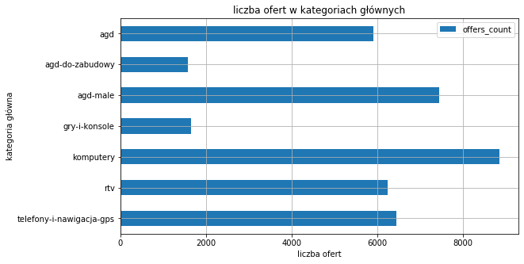
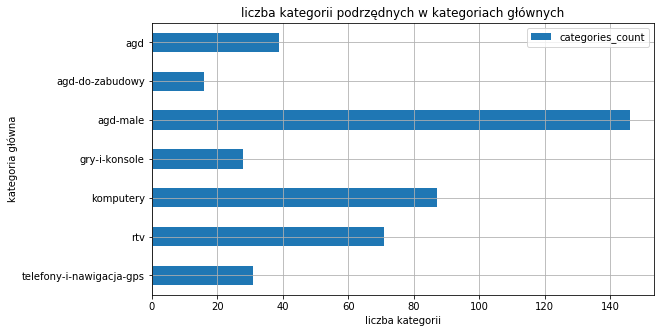
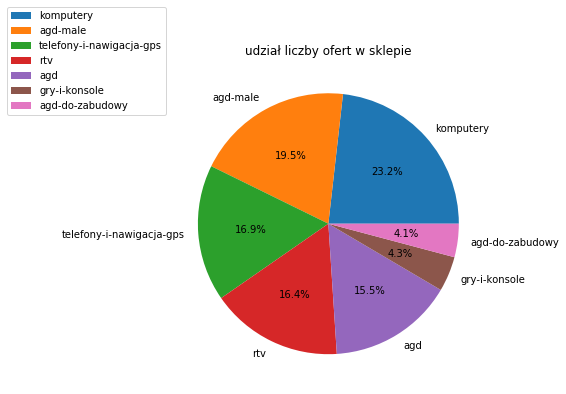
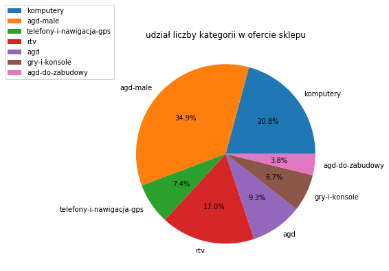
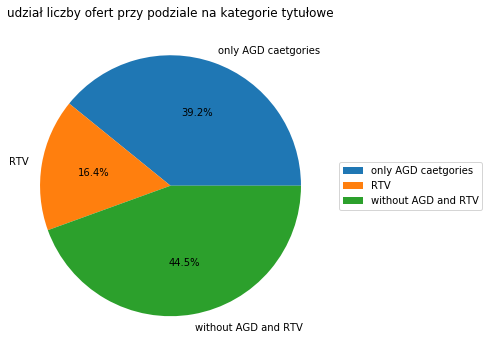
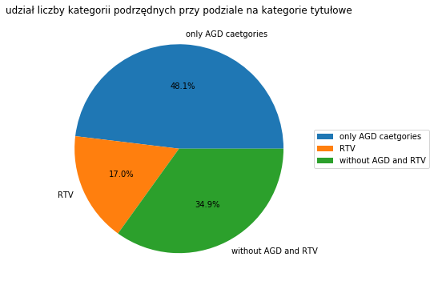
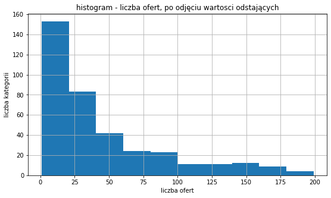

# Analiza kategorii w sklepie euro.com.pl

## 1. Wprowadzenie

### 1.1 Cel analizy

<p>
Analiza ma na celu poznanie dostępnych kategorii w sklepie internetowym euro.com.pl należącego do sieci sklepów RTV EURO AGD.
Dowiedzmy się, czy sklep RTV EURO AGD jest bardziej RTV, czy AGD, a może dominują produkty z nietytułowych kategorii. Wnioski z analizy będą pomocne przy analizowaniu promocji, cyklicznie pojawiających się w tym sklepie.
<p>

### 1.2 Pochodzenie zbioru danych

<p>
    Dane z analizowanego pliku pochodzą ze sklepu internetowego euro.com.pl. Zostały zebrane w dniu 31.01.2022 r. W tym celu posłużyłem się skryptem scrapującym napisanym w Pythonie. Kod źródłowy wykorzystanego skryptu oraz plik z zebranymi danymi znajduje się w folderze 'categories' tego repozytorium.
</p>

## 2. Wczytanie potrzebnych bibliotek


```python
import pandas as pd
import matplotlib.pyplot as plt
```

## 3. Wczytanie zbioru z danymi


```python
df = pd.read_csv('./categories/categories.csv', header=0)
```

### 3.1 Przegląd zbioru.


```python
print(f'Zbiór zawiera {df.shape[0]} obserwacji oraz {df.shape[1]} zmiennych.')
```

    Zbiór zawiera 418 obserwacji oraz 4 zmiennych.
    


```python
print(f'Dostępne zmienne: {df.columns.tolist()}')
```

    Dostępne zmienne: ['parent_category', 'category', 'link_to_category', 'offers_count']
    


```python
print(f'Typy zmiennych:')
df.dtypes
```

    Typy zmiennych:
    


    parent_category      object
    category             object
    link_to_category     object
    offers_count        float64
    dtype: object


```python
print(f'Zbior zawiera {len(df.parent_category.unique())} kategorii głównych:\n{df.parent_category.unique()}')
```

    Zbior zawiera 7 kategorii głównych:
    ['agd' 'agd-do-zabudowy' 'agd-male' 'rtv' 'telefony-i-nawigacja-gps'
     'komputery' 'gry-i-konsole']
    


```python
print(f'Zbior zawiera {len(df.category.unique())} kategorii podrzędnych.')
```

    Zbior zawiera 418 kategorii podrzędnych.
    


```python
nulls = pd.DataFrame({'has_null': df.isnull().any()})
nulls['qty'] = df.isnull().sum()
nulls['%']= round((df.isnull().mean()*100),2)
nulls
```


<div>
<style scoped>
    .dataframe tbody tr th:only-of-type {
        vertical-align: middle;
    }

    .dataframe tbody tr th {
        vertical-align: top;
    }

    .dataframe thead th {
        text-align: right;
    }
</style>
<table border="1" class="dataframe">
  <thead>
    <tr style="text-align: right;">
      <th></th>
      <th>has_null</th>
      <th>qty</th>
      <th>%</th>
    </tr>
  </thead>
  <tbody>
    <tr>
      <th>parent_category</th>
      <td>False</td>
      <td>0</td>
      <td>0.0</td>
    </tr>
    <tr>
      <th>category</th>
      <td>False</td>
      <td>0</td>
      <td>0.0</td>
    </tr>
    <tr>
      <th>link_to_category</th>
      <td>False</td>
      <td>0</td>
      <td>0.0</td>
    </tr>
    <tr>
      <th>offers_count</th>
      <td>False</td>
      <td>0</td>
      <td>0.0</td>
    </tr>
  </tbody>
</table>
</div>


<p>
    Zbior nie zawiera obserwacji, w których brakowało by danych.
</p>

## 4. Analiza zbioru

<p>
Na potrzeby dalszej analizy wykorzystywać będę wszystkie zmienne oprócz zmiennej zawierającej link do danej kategorii w sklepie euro.com.pl, dlatego ją usunę ze zbioru. Bliżej przyjrzę się samym kategoriom głównym, podrzędnym oraz zmiennej opisującej ilość ofert w poszczególnych kategoriach.
</p>


```python
df.drop('link_to_category', axis=1, inplace=True)
```

### 4.1 Analiza kategorii głównych

#### 4.1.1 Ogólne podsumowanie ilości ofert oraz ilości kategorii podrzędnych


```python
parent_categories_summary = df.groupby(['parent_category']).agg(offers_count=('offers_count','sum'), categories_count=('category', 'count'))
parent_categories_summary = parent_categories_summary.sort_values(by='offers_count', ascending=False)
parent_categories_summary = parent_categories_summary.reset_index()
parent_categories_summary['percent_of_offers'] = parent_categories_summary.offers_count.apply(lambda x: round(x/parent_categories_summary.offers_count.sum()*100, 2))
parent_categories_summary['percent_of_categories'] = parent_categories_summary.categories_count.apply(lambda x: round(x/parent_categories_summary.categories_count.sum()*100, 2))

parent_categories_summary
```


<div>
<style scoped>
    .dataframe tbody tr th:only-of-type {
        vertical-align: middle;
    }

    .dataframe tbody tr th {
        vertical-align: top;
    }

    .dataframe thead th {
        text-align: right;
    }
</style>
<table border="1" class="dataframe">
  <thead>
    <tr style="text-align: right;">
      <th></th>
      <th>parent_category</th>
      <th>offers_count</th>
      <th>categories_count</th>
      <th>percent_of_offers</th>
      <th>percent_of_categories</th>
    </tr>
  </thead>
  <tbody>
    <tr>
      <th>0</th>
      <td>komputery</td>
      <td>8858.0</td>
      <td>87</td>
      <td>23.21</td>
      <td>20.81</td>
    </tr>
    <tr>
      <th>1</th>
      <td>agd-male</td>
      <td>7453.0</td>
      <td>146</td>
      <td>19.53</td>
      <td>34.93</td>
    </tr>
    <tr>
      <th>2</th>
      <td>telefony-i-nawigacja-gps</td>
      <td>6457.0</td>
      <td>31</td>
      <td>16.92</td>
      <td>7.42</td>
    </tr>
    <tr>
      <th>3</th>
      <td>rtv</td>
      <td>6250.0</td>
      <td>71</td>
      <td>16.38</td>
      <td>16.99</td>
    </tr>
    <tr>
      <th>4</th>
      <td>agd</td>
      <td>5914.0</td>
      <td>39</td>
      <td>15.50</td>
      <td>9.33</td>
    </tr>
    <tr>
      <th>5</th>
      <td>gry-i-konsole</td>
      <td>1655.0</td>
      <td>28</td>
      <td>4.34</td>
      <td>6.70</td>
    </tr>
    <tr>
      <th>6</th>
      <td>agd-do-zabudowy</td>
      <td>1578.0</td>
      <td>16</td>
      <td>4.13</td>
      <td>3.83</td>
    </tr>
  </tbody>
</table>
</div>


```python
parent_categories_summary.agg(['sum'])[['offers_count','categories_count']].T
```


<div>
<style scoped>
    .dataframe tbody tr th:only-of-type {
        vertical-align: middle;
    }

    .dataframe tbody tr th {
        vertical-align: top;
    }

    .dataframe thead th {
        text-align: right;
    }
</style>
<table border="1" class="dataframe">
  <thead>
    <tr style="text-align: right;">
      <th></th>
      <th>sum</th>
    </tr>
  </thead>
  <tbody>
    <tr>
      <th>offers_count</th>
      <td>38165.0</td>
    </tr>
    <tr>
      <th>categories_count</th>
      <td>418.0</td>
    </tr>
  </tbody>
</table>
</div>


<p>
Analizując dane z powyższej tabeli można wyciągnąć prosty wniosek, iż obecnie to kategorie 'telefony-i-nawigacja-gps' oraz 'komputery' stanowią największą liczbę ofert w sklepie przy prezentowanym podziale na kategorie.
</p>
<p>
Jeśli chodzi o kategorie uwzglednione w nazwie marki sklepu, to wyraźnie wyróżnia się kategoria 'agd-małe' pod względem ilości ofert oraz kategorii podrzędnych.
</p>
<p>
    Kategorią najmniejszą jest 'gry-i-konsole' - zarówno najmniejszy udział w ofercie oraz kategoriach sklepu.
</p>
<p>
    W tym miejscu warto sięgnąć do definicji sprzetu <a href="https://pl.wikipedia.org/wiki/Artyku%C5%82y_gospodarstwa_domowego">AGD</a> oraz <a href="https://pl.wikipedia.org/wiki/Elektronika_u%C5%BCytkowa">RTV</a>. Uważam tak, gdyż pozwala to zrozumieć, jak wiele innych znaczących kategorii sprzętów elektronicznych wyłoniło się na przestrzeni lat, a które są w ofercie sklepu z założenia na początku mającego sprzedawać tylko sprzęty RTV i AGD.
</p>
<p>
    Sklep ma do zaoferowania ponad 38 tysięcy różnych towarów.
</p>


```python
parent_categories_summary[['parent_category','offers_count']].set_index('parent_category').sort_values(by='parent_category', ascending=False).plot.barh(figsize=(9,5))
plt.title('liczba ofert w kategoriach głównych')
plt.xlabel('liczba ofert')
plt.ylabel('kategoria główna')
plt.grid()
plt.savefig('./charts/liczba ofert w kategoriach głównych.png')
plt.show()
```


    

    


```python
parent_categories_summary[['parent_category','categories_count']].set_index('parent_category').sort_values(by='parent_category', ascending=False).plot.barh(figsize=(9,5))
plt.title('liczba kategorii podrzędnych w kategoriach głównych')
plt.xlabel('liczba kategorii')
plt.ylabel('kategoria główna')
plt.grid()
plt.savefig('./charts/liczba kategorii podrzędnych w kategoriach głównych.png')
plt.show()
```


    

    


```python
parent_categories_summary[['parent_category','offers_count']].set_index('parent_category').plot.pie(y='offers_count', autopct='%1.1f%%', figsize=(6,6))
plt.legend(loc='center left', bbox_to_anchor=(-0.5, 1))
plt.title('udział liczby ofert w sklepie')
plt.ylabel('')
plt.savefig(f'./charts/udział liczby ofert w sklepie.png')
plt.show()
```


    

    


```python
parent_categories_summary[['parent_category','categories_count']].set_index('parent_category').plot.pie(y='categories_count', autopct='%1.1f%%', figsize=(6,6))
plt.legend(loc='center left', bbox_to_anchor=(-0.5, 1))
plt.title('udział liczby kategorii w ofercie sklepu')
plt.ylabel('')
plt.savefig(f'./charts/udział liczby kategorii w ofercie sklepu.png')
plt.show()
```


    

    


#### 4.1.2 Analiza: agd vs rtv vs reszta kategorii


```python
only_within_agd = parent_categories_summary[parent_categories_summary.parent_category.str.contains('agd')]
rtv = parent_categories_summary[parent_categories_summary.parent_category == 'rtv']
without_agd_and_rtv = parent_categories_summary[~parent_categories_summary.parent_category.isin(list(only_within_agd.parent_category) + list(rtv.parent_category))]
```


```python
only_within_agd
```


<div>
<style scoped>
    .dataframe tbody tr th:only-of-type {
        vertical-align: middle;
    }

    .dataframe tbody tr th {
        vertical-align: top;
    }

    .dataframe thead th {
        text-align: right;
    }
</style>
<table border="1" class="dataframe">
  <thead>
    <tr style="text-align: right;">
      <th></th>
      <th>parent_category</th>
      <th>offers_count</th>
      <th>categories_count</th>
      <th>percent_of_offers</th>
      <th>percent_of_categories</th>
    </tr>
  </thead>
  <tbody>
    <tr>
      <th>1</th>
      <td>agd-male</td>
      <td>7453.0</td>
      <td>146</td>
      <td>19.53</td>
      <td>34.93</td>
    </tr>
    <tr>
      <th>4</th>
      <td>agd</td>
      <td>5914.0</td>
      <td>39</td>
      <td>15.50</td>
      <td>9.33</td>
    </tr>
    <tr>
      <th>6</th>
      <td>agd-do-zabudowy</td>
      <td>1578.0</td>
      <td>16</td>
      <td>4.13</td>
      <td>3.83</td>
    </tr>
  </tbody>
</table>
</div>


```python
print(f'Suma ofert w kategoriach głównych związanych z AGD: {only_within_agd.offers_count.sum()}')
print(f'Udział ofert z kategorii głównych związanych z AGD w całej ofercie: {round(only_within_agd.percent_of_offers.sum(),2)}%\n')
print(f'Suma kategorii podrzędnych w kategoriach głównych związanych z AGD: {only_within_agd.categories_count.sum()}')
print(f'Udział kategorii podrzędnych związanych z AGD w całym sklepie: {round(only_within_agd.percent_of_categories.sum(),2)}%')
```

    Suma ofert w kategoriach głównych związanych z AGD: 14945.0
    Udział ofert z kategorii głównych związanych z AGD w całej ofercie: 39.16%
    
    Suma kategorii podrzędnych w kategoriach głównych związanych z AGD: 201
    Udział kategorii podrzędnych związanych z AGD w całym sklepie: 48.09%
    


```python
rtv
```


<div>
<style scoped>
    .dataframe tbody tr th:only-of-type {
        vertical-align: middle;
    }

    .dataframe tbody tr th {
        vertical-align: top;
    }

    .dataframe thead th {
        text-align: right;
    }
</style>
<table border="1" class="dataframe">
  <thead>
    <tr style="text-align: right;">
      <th></th>
      <th>parent_category</th>
      <th>offers_count</th>
      <th>categories_count</th>
      <th>percent_of_offers</th>
      <th>percent_of_categories</th>
    </tr>
  </thead>
  <tbody>
    <tr>
      <th>3</th>
      <td>rtv</td>
      <td>6250.0</td>
      <td>71</td>
      <td>16.38</td>
      <td>16.99</td>
    </tr>
  </tbody>
</table>
</div>


```python
without_agd_and_rtv
```


<div>
<style scoped>
    .dataframe tbody tr th:only-of-type {
        vertical-align: middle;
    }

    .dataframe tbody tr th {
        vertical-align: top;
    }

    .dataframe thead th {
        text-align: right;
    }
</style>
<table border="1" class="dataframe">
  <thead>
    <tr style="text-align: right;">
      <th></th>
      <th>parent_category</th>
      <th>offers_count</th>
      <th>categories_count</th>
      <th>percent_of_offers</th>
      <th>percent_of_categories</th>
    </tr>
  </thead>
  <tbody>
    <tr>
      <th>0</th>
      <td>komputery</td>
      <td>8858.0</td>
      <td>87</td>
      <td>23.21</td>
      <td>20.81</td>
    </tr>
    <tr>
      <th>2</th>
      <td>telefony-i-nawigacja-gps</td>
      <td>6457.0</td>
      <td>31</td>
      <td>16.92</td>
      <td>7.42</td>
    </tr>
    <tr>
      <th>5</th>
      <td>gry-i-konsole</td>
      <td>1655.0</td>
      <td>28</td>
      <td>4.34</td>
      <td>6.70</td>
    </tr>
  </tbody>
</table>
</div>


```python
print(f'Suma ofert w kategoriach głównych niezwiązanych z RTV i AGD: {without_agd_and_rtv.offers_count.sum()}')
print(f'Udział ofert w kategoriach głównych niezwiązanych z RTV i AGD: {without_agd_and_rtv.percent_of_offers.sum()}%\n')
print(f'Suma kategorii podrzędnych w kategoriach głównych niezwiązanych z RTV i AGD: {without_agd_and_rtv.categories_count.sum()}')
print(f'Udział kategorii podrzędnych niezwiązanych z RTV i AGD: {without_agd_and_rtv.percent_of_categories.sum()}%')
```

    Suma ofert w kategoriach głównych niezwiązanych z RTV i AGD: 16970.0
    Udział ofert w kategoriach głównych niezwiązanych z RTV i AGD: 44.47%
    
    Suma kategorii podrzędnych w kategoriach głównych niezwiązanych z RTV i AGD: 146
    Udział kategorii podrzędnych niezwiązanych z RTV i AGD: 34.93%
    


```python
pie_offers = pd.DataFrame({'values': [only_within_agd.percent_of_offers.sum(), rtv.percent_of_offers.sum(), without_agd_and_rtv.percent_of_offers.sum()]})
pie_offers.index = ['only AGD caetgories', 'RTV', 'without AGD and RTV']
pie_offers.plot.pie(y='values', autopct='%1.1f%%', figsize=(6,6))
plt.legend(loc='center left', bbox_to_anchor=(1, 0.5))
plt.title('udział liczby ofert przy podziale na kategorie tytułowe')
plt.ylabel('')
plt.savefig(f'./charts/udział liczby ofert przy podziale na kategorie tytułowe.png')
plt.show()
```


    

    


```python
pie_categories = pd.DataFrame({'values': [only_within_agd.percent_of_categories.sum(), rtv.percent_of_categories.sum(), without_agd_and_rtv.percent_of_categories.sum()]})
pie_categories.index = ['only AGD caetgories', 'RTV', 'without AGD and RTV']
pie_categories.plot.pie(y='values', autopct='%1.1f%%', figsize=(6,6))
plt.legend(loc='center left', bbox_to_anchor=(1, 0.5))
plt.title('udział liczby kategorii podrzędnych przy podziale na kategorie tytułowe')
plt.ylabel('')
plt.savefig(f'./charts/udział liczby kategorii podrzędnych przy podziale na kategorie tytułowe.png')
plt.show()
```


    

    


##### 4.1.2.1 Wnioski

<p>
Oferty niezwiązane z AGD i RTV stanowią najwiekszą część oferty sklepu euro.com.pl. Na drugim miejscu plasują się kategorie związane z AGD, a dopiero na końcu RTV.</p><p>Powyższe dane pokazują, rozmiar i znaczenie kategorii związanych z komunikacją oraz rozrywką
</p>
<p>
    Najbardziej róznorodną grupą asortymentową są kategorie związane z AGD, a najmniej z RTV - patrz udział kategorii podrzędnych.
</p>

### 4.2 Analiza ilości ofert w kategoriach podrzędnych

#### 4.2.1 Wybrane statystyki


```python
df.offers_count.describe()
```


    count     418.000000
    mean       91.303828
    std       201.063315
    min         1.000000
    25%        11.000000
    50%        30.000000
    75%        89.750000
    max      2631.000000
    Name: offers_count, dtype: float64


```python
df.offers_count.agg(['min', 'median', 'max', 'mean'])
```


    min          1.000000
    median      30.000000
    max       2631.000000
    mean        91.303828
    Name: offers_count, dtype: float64


<p>Poniżej kategoria podrzędna z największą liczbą ofert:</p>


```python
df[df.offers_count == df.offers_count.max()]
```


<div>
<style scoped>
    .dataframe tbody tr th:only-of-type {
        vertical-align: middle;
    }

    .dataframe tbody tr th {
        vertical-align: top;
    }

    .dataframe thead th {
        text-align: right;
    }
</style>
<table border="1" class="dataframe">
  <thead>
    <tr style="text-align: right;">
      <th></th>
      <th>parent_category</th>
      <th>category</th>
      <th>offers_count</th>
    </tr>
  </thead>
  <tbody>
    <tr>
      <th>286</th>
      <td>telefony-i-nawigacja-gps</td>
      <td>folie-ochronne</td>
      <td>2631.0</td>
    </tr>
  </tbody>
</table>
</div>


<p>Poniżej kategorie podrzędne z najmniejszą liczbą ofert:</p>


```python
df[df.offers_count == df.offers_count.min()]
```


<div>
<style scoped>
    .dataframe tbody tr th:only-of-type {
        vertical-align: middle;
    }

    .dataframe tbody tr th {
        vertical-align: top;
    }

    .dataframe thead th {
        text-align: right;
    }
</style>
<table border="1" class="dataframe">
  <thead>
    <tr style="text-align: right;">
      <th></th>
      <th>parent_category</th>
      <th>category</th>
      <th>offers_count</th>
    </tr>
  </thead>
  <tbody>
    <tr>
      <th>22</th>
      <td>agd</td>
      <td>systemy-filtrujace-wode</td>
      <td>1.0</td>
    </tr>
    <tr>
      <th>23</th>
      <td>agd</td>
      <td>filtry-do-systemow-filtrujacych-wode</td>
      <td>1.0</td>
    </tr>
    <tr>
      <th>95</th>
      <td>agd-male</td>
      <td>kombiwary</td>
      <td>1.0</td>
    </tr>
    <tr>
      <th>98</th>
      <td>agd-male</td>
      <td>urzadzenie-do-czekolady</td>
      <td>1.0</td>
    </tr>
    <tr>
      <th>99</th>
      <td>agd-male</td>
      <td>chlebaki</td>
      <td>1.0</td>
    </tr>
    <tr>
      <th>159</th>
      <td>agd-male</td>
      <td>prasowalnice</td>
      <td>1.0</td>
    </tr>
    <tr>
      <th>170</th>
      <td>agd-male</td>
      <td>akcesoria-do-fotelikow-samochodowych</td>
      <td>1.0</td>
    </tr>
    <tr>
      <th>172</th>
      <td>agd-male</td>
      <td>zabawki</td>
      <td>1.0</td>
    </tr>
    <tr>
      <th>174</th>
      <td>agd-male</td>
      <td>pielegnacja-niemowlat</td>
      <td>1.0</td>
    </tr>
    <tr>
      <th>175</th>
      <td>agd-male</td>
      <td>lozeczka-dla-dzieci</td>
      <td>1.0</td>
    </tr>
    <tr>
      <th>177</th>
      <td>agd-male</td>
      <td>przechowywanie</td>
      <td>1.0</td>
    </tr>
    <tr>
      <th>195</th>
      <td>agd-male</td>
      <td>akcesoria-oswietleniowe</td>
      <td>1.0</td>
    </tr>
    <tr>
      <th>216</th>
      <td>rtv</td>
      <td>odtwarzacze-cd</td>
      <td>1.0</td>
    </tr>
    <tr>
      <th>236</th>
      <td>rtv</td>
      <td>filmy-dvd</td>
      <td>1.0</td>
    </tr>
    <tr>
      <th>255</th>
      <td>rtv</td>
      <td>wzmacniacze-sluchawkowe</td>
      <td>1.0</td>
    </tr>
    <tr>
      <th>302</th>
      <td>telefony-i-nawigacja-gps</td>
      <td>kask</td>
      <td>1.0</td>
    </tr>
    <tr>
      <th>356</th>
      <td>komputery</td>
      <td>bindownice</td>
      <td>1.0</td>
    </tr>
    <tr>
      <th>388</th>
      <td>komputery</td>
      <td>przetwornice</td>
      <td>1.0</td>
    </tr>
  </tbody>
</table>
</div>


#### 4.2.2 Analiza wartości odstających

<p>Przed pominięciem wartości odstających:<p>


```python
df.offers_count.quantile([.01,.25,.50,.75,.99])
```


    0.01      1.00
    0.25     11.00
    0.50     30.00
    0.75     89.75
    0.99    731.13
    Name: offers_count, dtype: float64


```python
q1, q3 = df.offers_count.quantile([.25,.75])
iqr = q3 - q1

print(f'Rozspęp kwartylny: {iqr}')
```

    Rozspęp kwartylny: 78.75
    


```python
df.offers_count.plot.hist(figsize=(9,5))
plt.title("histogram - liczba ofert")
plt.xlabel('liczba ofert')
plt.ylabel('liczba kategorii')
plt.grid()
plt.savefig('./charts/histogram - liczba ofert.png')
plt.show()
```


    

    


```python
down_boundary = q1-iqr*1.5
upper_boundary = q3+iqr*1.5

without_outliers = df[(df.offers_count < upper_boundary) & (df.offers_count > down_boundary)]
```

<p>Po pominięciu wartości odstających:</p>


```python
without_outliers.quantile([.01,.25,.50,.75,.99])
```


<div>
<style scoped>
    .dataframe tbody tr th:only-of-type {
        vertical-align: middle;
    }

    .dataframe tbody tr th {
        vertical-align: top;
    }

    .dataframe thead th {
        text-align: right;
    }
</style>
<table border="1" class="dataframe">
  <thead>
    <tr style="text-align: right;">
      <th></th>
      <th>offers_count</th>
    </tr>
  </thead>
  <tbody>
    <tr>
      <th>0.01</th>
      <td>1.00</td>
    </tr>
    <tr>
      <th>0.25</th>
      <td>10.00</td>
    </tr>
    <tr>
      <th>0.50</th>
      <td>25.50</td>
    </tr>
    <tr>
      <th>0.75</th>
      <td>61.25</td>
    </tr>
    <tr>
      <th>0.99</th>
      <td>178.48</td>
    </tr>
  </tbody>
</table>
</div>


```python
without_outliers.offers_count.plot.hist(figsize=(9,5))
plt.title("histogram - liczba ofert, po odjęciu wartosci odstających")
plt.xlabel('liczba ofert')
plt.ylabel('liczba kategorii')
plt.grid()
plt.savefig('./charts/histogram - liczba ofert, po odjęciu wartosci odstających.png')
plt.show()
```


    

    


```python
outliers = df[~df.category.isin(without_outliers.category)]
outliers.offers_count.describe()
```


    count      46.000000
    mean      476.434783
    std       432.093285
    min       222.000000
    25%       259.000000
    50%       320.500000
    75%       501.000000
    max      2631.000000
    Name: offers_count, dtype: float64


<p>Powyżej wybrane statystyki dla kategorii odstających pod względem ilości ofert, a poniżej nazwy tych kategorii z liczbą ofert posortowane od najliczniejszej:</p>


```python
outliers.sort_values(by='offers_count', ascending=False)[['category', 'offers_count']].values.tolist()
```


    [['folie-ochronne', 2631.0],
     ['zlewozmywaki', 1676.0],
     ['sluchawki', 1355.0],
     ['laptopy-i-netbooki', 779.0],
     ['telefony-komorkowe', 733.0],
     ['monitory-led-i-lcd', 722.0],
     ['okapy', 700.0],
     ['baterie-kuchenne', 654.0],
     ['myszy', 638.0],
     ['smartwatch', 611.0],
     ['kable-do-telefonow', 585.0],
     ['lodowki', 503.0],
     ['torby-do-laptopow', 495.0],
     ['sluchawki-dla-graczy-pc', 448.0],
     ['plyty-do-zabudowy', 444.0],
     ['telewizory-led-lcd-plazmowe', 428.0],
     ['pamieci-ram', 395.0],
     ['kawy', 391.0],
     ['czajniki', 382.0],
     ['akcesoria-do-zegarkow', 355.0],
     ['ladowarki-akumulatory-przenosne', 325.0],
     ['pendrive-pamieci-usb', 323.0],
     ['patelnie', 321.0],
     ['kable-apple-ipod-iphone-ipad', 320.0],
     ['piekarniki-do-zabudowy', 318.0],
     ['pralki', 296.0],
     ['kable', 295.0],
     ['glosniki-przenosne', 295.0],
     ['uchwyty-do-telefonow', 292.0],
     ['klawiatury', 281.0],
     ['ladowarki-sieciowe', 276.0],
     ['ekspresy-cisnieniowe', 275.0],
     ['garnki', 271.0],
     ['gry-xbox-one', 262.0],
     ['baterie-do-laptopow', 258.0],
     ['fotele-i-stojaki-do-kierownicy', 255.0],
     ['przybory-kuchenne', 250.0],
     ['gry-playstation-4', 240.0],
     ['dyski-wewnetrzne-ssd', 236.0],
     ['inteligentne-oswietlenie', 235.0],
     ['obudowy-pc', 233.0],
     ['kontrolery-do-gier', 233.0],
     ['plyty-glowne', 228.0],
     ['adaptery-i-przejsciowki', 227.0],
     ['podkladki-pod-mysz', 224.0],
     ['ladowarki-do-telefonow1', 222.0]]


##### 4.2.2.1 Wnioski

<p>Analiza przed pominięciem wartości odstających pokazała, iż ilość ofert w poszczególnych kategoriach jest bardzo zróżnicowana - widać to z resztą na histogramie.</p>
<p>
    Po pominięciu kategorii odstających oczom ukazał się obraz, iż większość kategorii posiada od 10 do 67 ofert.
    </p><p>Najczęściej kategorie mają od 26 do 33 ofert.
</p>

### Top 10 najwiekszych kategorii podrzędnych po kategoriach głównych:


```python
categories_summary = df.set_index('category').groupby('parent_category').offers_count.nlargest(10)
categories_summary = categories_summary.reset_index()

grouped = categories_summary.groupby('parent_category')

for group in grouped.groups:
    print(f'\n{group}:\n')
    data = categories_summary[categories_summary.parent_category == group].loc[:, 'category':]
    print(data.reset_index())
```

    
    agd:
    
       index          category  offers_count
    0      0      zlewozmywaki        1676.0
    1      1             okapy         700.0
    2      2  baterie-kuchenne         654.0
    3      3           lodowki         503.0
    4      4          patelnie         321.0
    5      5            pralki         296.0
    6      6            garnki         271.0
    7      7           kuchnie         157.0
    8      8          zmywarki         110.0
    9      9          suszarki         107.0
    
    agd-do-zabudowy:
    
       index                          category  offers_count
    0     10                 plyty-do-zabudowy         444.0
    1     11                              kawy         391.0
    2     12            piekarniki-do-zabudowy         318.0
    3     13              zmywarki-do-zabudowy         147.0
    4     14               lodowki-do-zabudowy         112.0
    5     15  kuchenki-mikrofalowe-do-zabudowy          85.0
    6     16                pralki-do-zabudowy          16.0
    7     17            zamrazarki-do-zabudowy          14.0
    8     18              ekspresy-do-zabudowy          10.0
    9     19                 szuflady-grzewcze          10.0
    
    agd-male:
    
       index                           category  offers_count
    0     20                           czajniki         382.0
    1     21               ekspresy-cisnieniowe         275.0
    2     22                  przybory-kuchenne         250.0
    3     23           inteligentne-oswietlenie         235.0
    4     24                         odkurzacze         198.0
    5     25          wyposazenie-do-odkurzaczy         191.0
    6     26            szczoteczki-elektryczne         175.0
    7     27  wyposazenie-do-robotow-kuchennych         175.0
    8     28                      noze-kuchenne         169.0
    9     29                 miksery-kielichowe         167.0
    
    gry-i-konsole:
    
       index                      category  offers_count
    0     30                  gry-xbox-one         262.0
    1     31             gry-playstation-4         240.0
    2     32            kontrolery-do-gier         233.0
    3     33                        gry-pc         126.0
    4     34       cyfrowe-dodatki-do-gier          96.0
    5     35             gry-playstation-5          83.0
    6     36           gry-nintendo-switch          74.0
    7     37  cyfrowe-dodatki-do-gier-xbox          68.0
    8     38           konsole-xbox-series          60.0
    9     39                 kierownice-pc          53.0
    
    komputery:
    
       index                        category  offers_count
    0     40              laptopy-i-netbooki         779.0
    1     41              monitory-led-i-lcd         722.0
    2     42                           myszy         638.0
    3     43               torby-do-laptopow         495.0
    4     44         sluchawki-dla-graczy-pc         448.0
    5     45                     pamieci-ram         395.0
    6     46            pendrive-pamieci-usb         323.0
    7     47                      klawiatury         281.0
    8     48             baterie-do-laptopow         258.0
    9     49  fotele-i-stojaki-do-kierownicy         255.0
    
    rtv:
    
       index                      category  offers_count
    0     50                     sluchawki        1355.0
    1     51            kable-do-telefonow         585.0
    2     52   telewizory-led-lcd-plazmowe         428.0
    3     53  kable-apple-ipod-iphone-ipad         320.0
    4     54            glosniki-przenosne         295.0
    5     55                         kable         295.0
    6     56       adaptery-i-przejsciowki         227.0
    7     57          glosniki-komputerowe         187.0
    8     58  kable-i-adaptery-komputerowe         173.0
    9     59          akcesoria-audio-hifi         166.0
    
    telefony-i-nawigacja-gps:
    
       index                         category  offers_count
    0     60                   folie-ochronne        2631.0
    1     61               telefony-komorkowe         733.0
    2     62                       smartwatch         611.0
    3     63            akcesoria-do-zegarkow         355.0
    4     64  ladowarki-akumulatory-przenosne         325.0
    5     65             uchwyty-do-telefonow         292.0
    6     66               ladowarki-sieciowe         276.0
    7     67          ladowarki-do-telefonow1         222.0
    8     68     ipad-i-tablety-multimedialne         199.0
    9     69                    karty-pamieci         154.0
    


```python

```


```python

```
